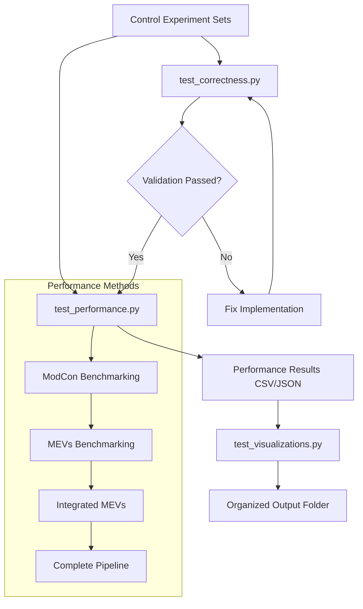

# iCoExpNet Optimization Testing Suite

## Overview

This documentation provides a comprehensive guide to the bioinformatics optimization testing suite for the iCoExpNet project. The suite consists of three main testing scripts that validate and benchmark various optimization strategies for transcription factor (TF) co-expression network analysis.

## Table of Contents

1. [Quick Start Guide](#quick-start-guide)
2. [Test Scripts Overview](#test-scripts-overview)
3. [Input Data Requirements](#input-data-requirements)
4. [How Tests Are Linked](#how-tests-are-linked)
5. [Detailed Script Documentation](#detailed-script-documentation)
6. [Results Interpretation](#results-interpretation)
7. [Configuration and Customization](#configuration-and-customization)
8. [Troubleshooting](#troubleshooting)

---

## Quick Start Guide

### Prerequisites

1. **Environment Setup**:
   ```bash
   conda activate iNet_gt
   cd /path/to/iCoExpNet/src/icoexpnet/optimisation
   ```

2. **Required Data**:
   - Control experiment sets in `../../../results/testCtrl/`
   - Test mutation data in `../../../data/test_mutation_data.tsv`
   - TF names file in `../../../data/TF_names_v_1.01.txt`

### Running the Complete Test Suite

```bash
# 1. Validate correctness (recommended first step)
python test_correctness.py --fail-fast

# 2. Benchmark performance for all methods
python test_performance.py --fail-fast

# 3. Generate visualizations
python test_visualizations.py --fail-fast
```

### Quick Testing

```bash
# Test specific methods
python test_performance.py --test modcon --fail-fast
python test_performance.py --test mevs --fail-fast
python test_performance.py --test imevs --fail-fast
python test_performance.py --test pipeline --fail-fast

# Quick validation with reduced output
python test_correctness.py --test --fail-fast
python test_visualizations.py --test --fail-fast
```

---

## Test Scripts Overview

### 🔍 1. `test_correctness.py` - Correctness Validation
**Purpose**: Validates that optimized methods produce identical results to original implementations.

**What it tests**:
- ModCon computation accuracy
- MEVs calculation correctness  
- Data integrity across optimizations

**When to run**: Before performance testing to ensure optimizations don't break functionality.

### ⚡ 2. `test_performance.py` - Performance Benchmarking
**Purpose**: Measures speed improvements from optimization techniques.

**What it tests**:
- ModCon computation speedup (multiprocessing)
- MEVs calculation speedup (vectorization)
- Integrated MEVs speedup (combined optimizations)
- Complete pipeline speedup (end-to-end optimization)

**When to run**: After correctness validation to quantify performance gains.

### 📊 3. `test_visualizations.py` - Results Analysis
**Purpose**: Generates comprehensive visualizations and reports from performance data.

**What it creates**:
- Speedup comparison plots
- Before/after timing analyses
- Statistical summaries
- Performance dashboards

**When to run**: After performance benchmarking to analyze and present results.

---

## Input Data Requirements

### Control Experiment Sets
**Location**: `../../../results/testCtrl/tctrl_1/` through `tctrl_5/`

**Structure**: Each control set contains:
```
tctrl_X/
├── standard_5K_3TF_hsbm/    # 3 transcription factors
├── standard_5K_4TF_hsbm/    # 4 transcription factors  
├── standard_5K_5TF_hsbm/    # 5 transcription factors
├── standard_5K_6TF_hsbm/    # 6 transcription factors
├── standard_5K_7TF_hsbm/    # 7 transcription factors
├── standard_5K_8TF_hsbm/    # 8 transcription factors
└── standard_5K_9TF_hsbm/    # 9 transcription factors
```

**Required files per experiment**:
- `network.gt` - Graph-tool network file
- `communities.csv` - Community detection results
- `tpm_data.tsv` - TPM expression data
- `mutations.tsv` - Mutation data

### Supporting Data Files
**Location**: `../../../data/`

1. **`test_mutation_data.tsv`**: 
   - Mutation data for analysis
   - Format: Gene symbol, mutation status
   - Size: ~55,404 entries

2. **`TF_names_v_1.01.txt`**:
   - List of transcription factor names
   - Size: ~1,639 TF names
   - Used for filtering and validation

### Changing Input Data

To modify input data for testing:

1. **Different TF counts**: Add new experiment folders following naming convention `standard_5K_XTF_hsbm`
2. **Different gene counts**: Modify the `5K` part (e.g., `standard_10K_5TF_hsbm`)
3. **Different algorithms**: Change the `hsbm` suffix to algorithm name
4. **Additional control sets**: Add `tctrl_6/`, `tctrl_7/`, etc.

**Important**: Update file paths in test scripts if data location changes.

---

## How Tests Are Linked

### Data Flow Pipeline



### Method Dependencies

1. **ModCon → MEVs**: MEVs requires ModCon computation as prerequisite
2. **ModCon + MEVs → Integrated MEVs**: Combines both optimizations
3. **All Methods → Pipeline**: Tests complete optimized workflow
4. **Performance Results → Visualizations**: Analysis depends on benchmark data

### Result File Relationships

```
results/optimization_tests/
├── logs/                           # Execution logs with timestamps
├── results/                        # Performance data (CSV/JSON)
│   ├── modcon_performance_*.csv    # ModCon benchmark results
│   ├── mevs_performance_*.csv      # MEVs benchmark results  
│   ├── imevs_performance_*.csv     # Integrated MEVs results
│   ├── pipeline_performance_*.csv  # Complete pipeline results
│   └── all_performance_results_*.json # Combined results
└── figures/                        # Visualization outputs
    └── run_YYYYMMDD_HHMMSS/        # Timestamped visualization sets
        ├── speedup_comparison.html
        ├── timing_before_after.html
        ├── statistical_summary.png
        ├── performance_dashboard.html
        └── optimization_summary.txt
```

---

## Detailed Script Documentation

### 🔍 `test_correctness.py`

#### Purpose
Validates that optimized implementations produce identical results to original methods, ensuring no functionality is lost during optimization.

#### Command Line Options
```bash
python test_correctness.py [OPTIONS]

Options:
  --fail-fast     Exit immediately on first validation failure
  --test          Run in test mode with reduced logging
  --runs N        Number of validation runs per experiment (default: 3)
```

#### What It Tests
1. **ModCon Correctness**: Compares original vs optimized ModCon computation
2. **DataFrame Integrity**: Validates data structure preservation
3. **Numerical Accuracy**: Ensures computation precision is maintained

#### Success Criteria
- All optimized results match original results exactly
- No data corruption or loss
- Consistent performance across multiple runs

#### Typical Runtime
- **Test mode**: ~30 seconds
- **Full validation**: ~2-3 minutes
- **Per experiment**: ~5-10 seconds

---

### ⚡ `test_performance.py`

#### Purpose
Quantifies performance improvements from optimization techniques across different computational methods.

#### Command Line Options
```bash
python test_performance.py [OPTIONS]

Options:
  --fail-fast           Exit immediately on first error
  --test METHOD         Run specific test (modcon|mevs|imevs|pipeline)
  --runs N              Number of benchmark runs (default: 3)
  --quick               Quick test mode with fewer iterations
```

#### Benchmark Methods

##### 1. **ModCon Performance** (`--test modcon`)
- **Optimization**: Multiprocessing parallelization
- **Expected Speedup**: 20-30x
- **Test Scope**: All TF counts (30-35 TFs)
- **Sample Size**: 35 experiments (5 control sets × 7 TF counts)

##### 2. **MEVs Performance** (`--test mevs`)  
- **Optimization**: Vectorized pandas operations
- **Expected Speedup**: 10-20x
- **Test Scope**: All TF counts (30-35 TFs)
- **Sample Size**: 35 experiments

##### 3. **Integrated MEVs** (`--test imevs`)
- **Optimization**: Combined ModCon + MEVs optimizations
- **Expected Speedup**: 15-25x
- **Test Scope**: Subset of experiments (computationally intensive)
- **Sample Size**: 15 experiments (5 control sets × 3 experiments each)

##### 4. **Complete Pipeline** (`--test pipeline`)
- **Optimization**: End-to-end optimized workflow
- **Expected Speedup**: 1.5-2x (more conservative due to I/O overhead)
- **Test Scope**: All TF counts for comprehensive coverage
- **Sample Size**: 7 experiments (1 control set × 7 TF counts)

#### Result Metrics
- **Speedup**: Ratio of original time to optimized time
- **Time Saved Percentage**: `(original_time - optimized_time) / original_time * 100`
- **Average Execution Time**: Mean time across multiple runs
- **Standard Deviation**: Variability in performance

#### Typical Runtime
- **ModCon**: ~2-3 minutes
- **MEVs**: ~1-2 minutes
- **iMEVs**: ~3-5 minutes (includes ModCon computation)
- **Pipeline**: ~4-5 minutes
- **Complete Suite**: ~10-15 minutes

---

### 📊 `test_visualizations.py`

#### Purpose
Generates comprehensive visualizations and statistical analyses from performance benchmark results.

#### Command Line Options
```bash
python test_visualizations.py [OPTIONS]

Options:
  --fail-fast              Exit immediately on first error
  --test                   Test mode with reduced logging
  --output-dir PATH        Custom output directory (default: auto-generated)
```

#### Generated Visualizations

##### 1. **Speedup Comparison Plot** (`speedup_comparison.html/.png`)
- **Type**: Interactive multi-panel plot (Plotly)
- **Panels**: Box plots, scatter plots, bar charts, violin plots
- **Purpose**: Compare speedup distributions across methods
- **Key Insights**: Relative performance of different optimization strategies

##### 2. **Timing Before/After Comparison** (`timing_before_after.html/.png`)
- **Type**: Grouped bar charts
- **Purpose**: Visualize absolute time improvements
- **Key Insights**: Actual time savings per method and TF count

##### 3. **Statistical Summary** (`statistical_summary.png`)
- **Type**: Multi-panel matplotlib figure
- **Panels**: Distribution plots, correlation matrix, variance analysis
- **Purpose**: Detailed statistical analysis of performance data
- **Key Insights**: Performance consistency and correlations

##### 4. **Performance Dashboard** (`performance_dashboard.html`)
- **Type**: Interactive dashboard (Plotly)
- **Components**: Gauges, pie charts, scatter plots, histograms
- **Purpose**: Executive summary with key performance indicators
- **Key Insights**: Overall optimization impact and distribution

##### 5. **Summary Report** (`optimization_summary.txt`)
- **Type**: Text report
- **Content**: Statistical summaries, performance metrics, experiment counts
- **Purpose**: Quantitative summary for documentation and reporting

#### Output Organization
Each visualization run creates a timestamped folder:
```
figures/run_20250831_130910/
├── speedup_comparison.html         # Interactive speedup analysis
├── speedup_comparison.png         # Static speedup plots  
├── timing_before_after.html       # Interactive timing comparison
├── timing_before_after.png        # Static timing plots
├── statistical_summary.png        # Statistical analysis
├── performance_dashboard.html     # Executive dashboard
└── optimization_summary.txt       # Text report
```

#### Typical Runtime
- **Generation Time**: ~1-2 seconds
- **File Count**: 7 files per run
- **Dependencies**: Requires performance result files from `test_performance.py`

---

## Results Interpretation

### Performance Metrics

#### Speedup Interpretation
- **1.0x**: No improvement (baseline)
- **2.0x**: 50% time reduction (2x faster)
- **10.0x**: 90% time reduction (10x faster)
- **25.0x**: 96% time reduction (25x faster)

#### Expected Performance Ranges

| Method | Expected Speedup | Confidence Level | Bottleneck |
|--------|------------------|------------------|------------|
| ModCon | 20-30x | High | CPU parallelization |
| MEVs | 10-20x | High | Vectorized operations |
| Integrated MEVs | 15-25x | Medium | Combined optimizations |
| Complete Pipeline | 1.5-2.0x | Medium | I/O and overhead |

### Quality Indicators

#### 🟢 Good Performance
- **ModCon**: >20x speedup
- **MEVs**: >10x speedup  
- **Pipeline**: >1.5x speedup
- **Consistency**: Standard deviation <20% of mean

#### 🟡 Acceptable Performance
- **ModCon**: 15-20x speedup
- **MEVs**: 8-10x speedup
- **Pipeline**: 1.2-1.5x speedup
- **Consistency**: Standard deviation 20-30% of mean

#### 🔴 Poor Performance
- **ModCon**: <15x speedup
- **MEVs**: <8x speedup
- **Pipeline**: <1.2x speedup
- **Consistency**: Standard deviation >30% of mean

### Performance Trends

#### Expected Scaling
- **ModCon**: Should scale linearly with TF count (more TFs = more speedup potential)
- **MEVs**: Should be consistent across TF counts (vectorization efficiency)
- **Pipeline**: May decrease slightly with larger TF counts (overhead effects)

#### Red Flags
- Speedup decreasing with TF count (scaling issues)
- High variability across runs (instability)
- Speedup <1.0x (optimization making things worse)

---

## Configuration and Customization

### Modifying Test Parameters

#### Experiment Scope
```python
# In test_performance.py - benchmark_pipeline_performance()
exp_keys = list(ctrl_data["exps"].keys())[:2]  # Limit to first 2 experiments
exp_keys = list(ctrl_data["exps"].keys())      # Test all experiments
```

#### Control Set Selection
```python
# In test_performance.py - benchmark_imevs_performance()
test_ctrl_keys = list(self.ctrl_exps.keys())[:2]  # First 2 control sets
test_ctrl_keys = list(self.ctrl_exps.keys())      # All control sets
```

#### Number of Runs
```bash
python test_performance.py --runs 5  # 5 runs per experiment
python test_performance.py --runs 1  # Quick single run
```

### Adding New Test Methods

To add a new optimization method:

1. **Add benchmark method** in `PerformanceTester` class:
```python
def benchmark_newmethod_performance(self, num_runs=3):
    # Implementation here
    pass
```

2. **Add argument parsing** in `parse_arguments()`:
```python
parser.add_argument('--test', choices=['modcon', 'mevs', 'imevs', 'pipeline', 'newmethod'])
```

3. **Add to main function** in `run_performance_tests()`:
```python
elif args.test == 'newmethod':
    results['newmethod'] = tester.benchmark_newmethod_performance(num_runs=args.runs)
```

### Customizing Output Locations

#### Performance Results
```python
# In test_performance.py - save_results()
results_dir = Path("../../../results/optimization_tests/results")
```

#### Visualization Output
```bash
python test_visualizations.py --output-dir /custom/path/to/figures
```

---

## Advanced Usage

### Batch Testing

#### Testing Multiple Configurations
```bash
# Test different run counts
for runs in 1 3 5; do
    python test_performance.py --test modcon --runs $runs --fail-fast
done

# Test all methods individually
for method in modcon mevs imevs pipeline; do
    python test_performance.py --test $method --fail-fast
done
```

#### Automated Full Suite
```bash
#!/bin/bash
# Full automated testing pipeline

echo "Step 1: Correctness validation"
python test_correctness.py --fail-fast || exit 1

echo "Step 2: Performance benchmarking" 
python test_performance.py --fail-fast || exit 1

echo "Step 3: Visualization generation"
python test_visualizations.py --fail-fast || exit 1

echo "All tests completed successfully!"
```

### Memory Optimization

For large datasets or memory-constrained environments:

```python
# Reduce number of experiments tested
exp_keys = list(ctrl_data["exps"].keys())[:3]  # Limit scope

# Reduce number of runs
num_runs = 1  # Single run instead of multiple

# Use fewer control sets
test_ctrl_keys = list(self.ctrl_exps.keys())[:2]  # Limit control sets
```

---

## Data Flow and Dependencies

### Sequential Dependencies

1. **Input Data** → **Correctness Tests** → **Performance Tests** → **Visualizations**

2. **Method Dependencies**:
   ```
   ModCon Computation → MEVs Analysis → Integrated MEVs → Complete Pipeline
   ```

3. **File Dependencies**:
   ```
   Control Experiments → Performance CSV → Visualization HTML/PNG
   ```

### Parallel Execution

**Safe to run in parallel**:
- Different test methods (`--test modcon` and `--test mevs` simultaneously)
- Correctness and visualization (don't share resources)

**NOT safe to run in parallel**:
- Same method multiple times (file conflicts)
- Performance tests that modify shared experiment data

---

## Common Workflow Patterns

### 1. **Development Workflow**
```bash
# Quick validation during development
python test_correctness.py --test --fail-fast
python test_performance.py --test modcon --runs 1 --fail-fast
python test_visualizations.py --test
```

### 2. **Pre-Release Validation**
```bash
# Comprehensive validation before release
python test_correctness.py --fail-fast
python test_performance.py --fail-fast  
python test_visualizations.py --fail-fast
```

### 3. **Research Analysis**
```bash
# Generate publication-ready results
python test_performance.py --runs 5 --fail-fast        # Higher precision
python test_visualizations.py --fail-fast              # Comprehensive plots
```

### 4. **Troubleshooting**
```bash
# Debug specific issues
python test_correctness.py --test --fail-fast          # Validate functionality
python test_performance.py --test modcon --fail-fast   # Isolate performance issues
```

---

## Troubleshooting

### Common Issues

#### 1. **Module Import Errors**
```
ModuleNotFoundError: No module named 'multiprocess'
```
**Solution**: Ensure conda environment is activated
```bash
conda activate iNet_gt
```

#### 2. **File Not Found Errors**
```
FileNotFoundError: No such file or directory: '../../../data/test_mutation_data.tsv'
```
**Solution**: Run from correct directory
```bash
cd /path/to/iCoExpNet/src/icoexpnet/optimisation
```

#### 3. **Memory Issues**
```
MemoryError: Unable to allocate memory
```
**Solution**: Reduce test scope
```bash
python test_performance.py --test modcon --runs 1  # Reduce scope
```

#### 4. **Performance Regression**
```
Speedup: 0.8x (performance got worse)
```
**Solution**: 
- Check system load (other processes competing)
- Validate input data integrity
- Review optimization implementation

### Debug Mode

Enable detailed logging:
```python
# In any test script
logging.basicConfig(level=logging.DEBUG)
```

### Validation Checklist

Before running tests:
- [ ] Conda environment activated (`iNet_gt`)
- [ ] Working directory is `src/icoexpnet/optimisation/`
- [ ] Control experiment data exists
- [ ] Required data files present
- [ ] Previous test results cleared (if needed)

---

## Performance Expectations

### Hardware Requirements

**Minimum**:
- 8 GB RAM
- 4 CPU cores
- 1 GB free disk space

**Recommended**:
- 16+ GB RAM  
- 8+ CPU cores
- 5+ GB free disk space

### Scaling Characteristics

#### CPU Scaling
- **ModCon**: Scales linearly with CPU count (multiprocessing)
- **MEVs**: Limited scaling (vectorized operations)
- **Pipeline**: Moderate scaling (I/O bound components)

#### Memory Scaling  
- **Per Experiment**: ~100-200 MB
- **Full Suite**: ~2-4 GB peak usage
- **Control Sets**: ~500 MB per control set

#### Time Scaling
| TF Count | ModCon | MEVs | iMEVs | Pipeline |
|----------|---------|------|-------|----------|
| 3-4 TFs  | 30s     | 20s  | 45s   | 30s      |
| 5-6 TFs  | 35s     | 22s  | 50s   | 32s      |
| 7-9 TFs  | 40s     | 25s  | 55s   | 35s      |

---

## Best Practices

### 1. **Always Validate First**
```bash
# Run correctness before performance
python test_correctness.py --fail-fast
```

### 2. **Use Fail-Fast in Development**
```bash
# Catch issues early
python test_performance.py --fail-fast
```

### 3. **Organize Results by Session**
- Visualization script automatically creates timestamped folders
- Keep related benchmark runs together
- Archive old results periodically

### 4. **Monitor System Resources**
```bash
# Check system load before running
top -l 1 -s 0 | grep "CPU usage"
```

### 5. **Regular Validation**
- Run correctness tests after any optimization changes
- Benchmark performance after significant modifications
- Generate fresh visualizations for presentations

---

## Support and Maintenance

### Updating Test Data

1. **New Control Sets**: Add folders `tctrl_6/`, `tctrl_7/`, etc.
2. **New TF Counts**: Add experiment folders with appropriate naming
3. **New Algorithms**: Update folder naming and parsing logic

### Script Maintenance

**When to update scripts**:
- New optimization methods added
- Different input data formats
- Additional performance metrics needed
- New visualization requirements

### Version Compatibility

**Current Version**: v1.1
**Python Requirement**: 3.12+
**Key Dependencies**: 
- pandas ≥1.5.0
- numpy ≥1.24.0
- plotly ≥5.0.0
- matplotlib ≥3.9.0
- seaborn ≥0.12.0

---

## Contact and Support

For questions or issues with the optimization testing suite:

**Author**: Vlad Ungureanu & Claude  
**Contact**: vlad.ungureanu@york.ac.uk  
**Version**: 1.1  
**Last Updated**: August 31, 2025

---

*This documentation is part of the iCoExpNet project optimization suite. For the latest updates and additional resources, check the project repository.*
